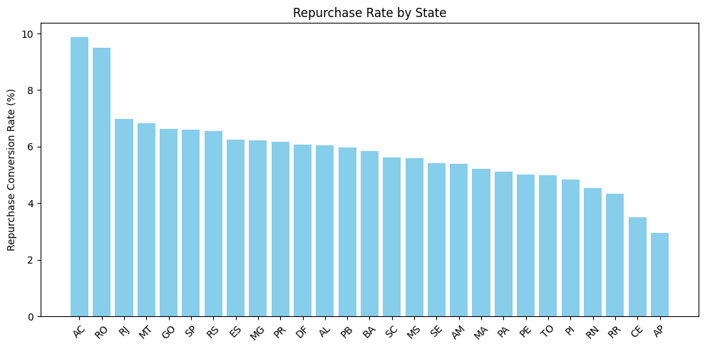
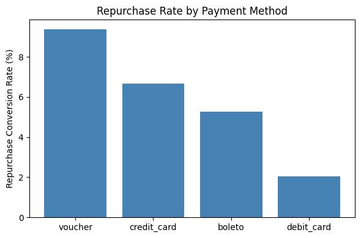
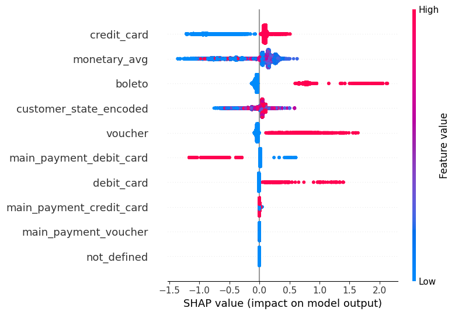
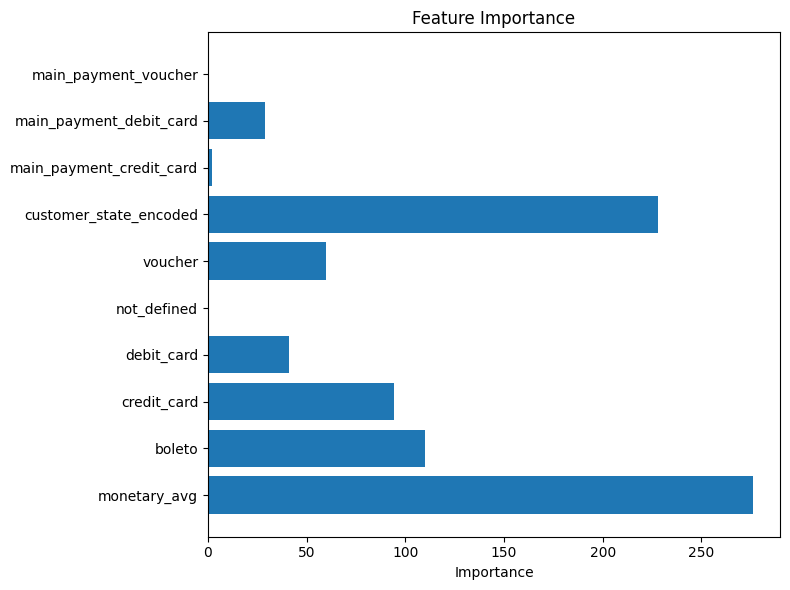
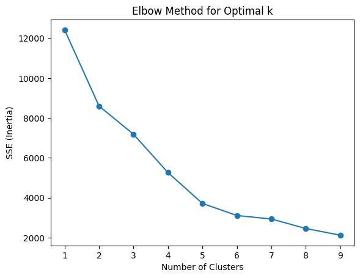

# Brazilian E-Commerce Public Dataset by Olist
https://www.kaggle.com/datasets/olistbr/brazilian-ecommerce/data

## **分析目標**
 
- 目標客群（Who）：已經完成首購的客戶，預測「誰會再次購買」。

- 目標行為（What）：預測哪些客戶會回購。

- 商業價值（Why）：針對高機率回購客戶進行廣告再行銷，提升轉換率並降低廣告浪費，提高ROAS。

## **分析問題**

- 哪些客戶有最高機率再次購買？

- 哪些付款方式、地區或商品類別的客戶忠誠度較高？

- 如何透過精準投放廣告，提高回購轉換率並降低 CPA？

## **目錄**

[1. 資料整理](#1-資料整理)

[2. 特徵工程](#2-特徵工程)

[3. 漏斗分析](#3-漏斗分析)

[4. 建立預測模型 (LightGBM)](#4-建立預測模型-LightGBM)

[5. 客戶分群分析](#5-客戶分群分析-Audience-Segmentation)

[6. 結論與建議](#6-結論與建議)

---

### **1. 資料整理**

| 表格名稱             | 主要內容   | 用途                |
| ---------------- | ------ | ----------------- |
| `orders`     | 訂單資料   | 計算首次購買、回購行為標記 |
| `customers` | 客戶基本資料   |  分析地區、客戶類型等特徵   |
| `order_items`  | 商品明細 | 計算消費金額、商品類別      |
| `order_payments` | 付款資料   | 付款方式分析       |


```python
# !pip install pandas
```


```python
import pandas as pd

# 載入 Olist 主要資料表
orders = pd.read_csv('olist_orders_dataset.csv')
customers = pd.read_csv('olist_customers_dataset.csv')
order_items = pd.read_csv('olist_order_items_dataset.csv')
payments = pd.read_csv('olist_order_payments_dataset.csv')
```

建立目標變數 - 是否再次購買

- 連接 `customer_id` 與 `customer_unique_id`


```python
customer_lookup = customers[['customer_id', 'customer_unique_id']]
orders = orders.merge(customer_lookup, on='customer_id', how='left')
```


```python
# merge() 是一個函數，用來將兩個 DataFrame 進行合併
# on 是一個參數，用來指定合併的欄位(對應欄位)(欄位名稱相同)
# how 是一個參數，用來指定合併的方式
# 'left' 代表左邊的 DataFrame 為主，右邊的 DataFrame 為輔
# 這樣的合併方式會保留左邊 DataFrame 的所有資料
# 右邊 DataFrame 的資料會根據左邊 DataFrame 的資料進行合併
```

- 計算每位客戶的訂單次數


```python
customer_order_counts = orders.groupby('customer_unique_id')['order_id'].count().reset_index()
customer_order_counts.columns = ['customer_unique_id', 'order_count']
```


```python
# groupby() 是一個分組函數，用來將資料依照某個欄位進行分組
# count() 是一個聚合函數，用來計算每個客戶的訂單數量
# reset_index() 是一個函數，用來將分組後的結果轉換成 DataFrame 格式
# columns 是一個屬性，用來設定 DataFrame 的欄位名稱
```

- 設定目標變數 `is_repurchase`：訂單數 ≥ 2 就算有回購。


```python
customer_order_counts['is_repurchase'] = (customer_order_counts['order_count'] >= 2).astype(int)
```


```python
# astype() 是一個函數，用來將資料轉換成指定的資料型別
```


```python
customer_order_counts.head()
```


<div>
<table border="1" class="dataframe">
  <thead>
    <tr style="text-align: right;">
      <th></th>
      <th>customer_unique_id</th>
      <th>order_count</th>
      <th>is_repurchase</th>
    </tr>
  </thead>
  <tbody>
    <tr>
      <th>0</th>
      <td>0000366f3b9a7992bf8c76cfdf3221e2</td>
      <td>1</td>
      <td>0</td>
    </tr>
    <tr>
      <th>1</th>
      <td>0000b849f77a49e4a4ce2b2a4ca5be3f</td>
      <td>1</td>
      <td>0</td>
    </tr>
    <tr>
      <th>2</th>
      <td>0000f46a3911fa3c0805444483337064</td>
      <td>1</td>
      <td>0</td>
    </tr>
    <tr>
      <th>3</th>
      <td>0000f6ccb0745a6a4b88665a16c9f078</td>
      <td>1</td>
      <td>0</td>
    </tr>
    <tr>
      <th>4</th>
      <td>0004aac84e0df4da2b147fca70cf8255</td>
      <td>1</td>
      <td>0</td>
    </tr>
  </tbody>
</table>
</div>

[🔼返回目錄](#目錄)


### **2. 特徵工程**

📌 **RFM** 

Recency (假設與整個資料集最後一次購買的天數差距)


```python
orders['order_purchase_timestamp'] = pd.to_datetime(orders['order_purchase_timestamp'])
last_order_date = orders['order_purchase_timestamp'].max() # 資料中最後一筆訂單的購買日期

recency_df = orders.groupby('customer_unique_id')['order_purchase_timestamp'].max().reset_index()
recency_df['recency_days'] = (last_order_date - recency_df['order_purchase_timestamp']).dt.days
recency_df.drop(columns='order_purchase_timestamp', inplace=True)

```


```python
# to_datetime() 是一個函數，用來將字串轉換成日期時間格式
# max() 是一個函數，用來計算每個客戶的最後訂單日期
# dt 是一個屬性，用來存取日期時間格式的屬性
# days 是一個屬性，用來計算日期時間格式的天數差
# drop() 是一個函數，用來刪除指定的欄位
# inplace 是一個參數，用來指定是否在原始資料上進行修改
```

Frequency（購買頻率）


```python
# customer_order_counts['order_count']
```

Monetary（平均消費金額）


```python
order_items['price_total'] = order_items['price'] + order_items['freight_value'] # freight_value 運費
order_values = order_items.groupby('order_id')['price_total'].sum().reset_index()
orders_monetary = orders[['order_id', 'customer_unique_id']].merge(order_values, on='order_id')

monetary_df = orders_monetary.groupby('customer_unique_id')['price_total'].mean().reset_index()
monetary_df.columns = ['customer_unique_id', 'monetary_avg']
```


```python
# sum() 是一個函數，用來計算每個訂單的總金額
# mean() 是一個函數，用來計算每個客戶的平均訂單金額
```

📌 **付款方式**


```python
payments_mode = payments.groupby(['order_id', 'payment_type']).size().unstack(fill_value=0).reset_index() # One-Hot Encoding
orders_payments = orders[['order_id', 'customer_unique_id']].merge(payments_mode, on='order_id')
payment_summary = orders_payments.groupby('customer_unique_id').sum().reset_index()
```


```python
# size() 是一個函數，用來計算每個訂單的付款方式數量
# unstack() 是一個函數，用來將資料轉換成寬格式 
# 寬格式指資料表格中，每一列代表一個觀察單位，而不同欄位則代表該單位在不同時間點或不同變數下的觀察值。
# fill_value 是一個參數，用來指定填入的值
```

📌 **客戶所屬州別**


```python
customer_states = customers[['customer_unique_id', 'customer_state']]
```

合併所有特徵與目標變數


```python
# 合併所有資料表
features = customer_order_counts.merge(recency_df, on='customer_unique_id', how='left')
features = features.merge(monetary_df, on='customer_unique_id', how='left')
features = features.merge(payment_summary, on='customer_unique_id', how='left')
features = features.merge(customer_states, on='customer_unique_id', how='left')

# 填補缺失值
features.fillna(0, inplace=True)
```


```python
# fillna() 是一個函數，用來填補缺失值
# inplace 是一個參數，用來指定是否在原始資料上進行修改
```


```python
features.head()
```


<div>
<table border="1" class="dataframe">
  <thead>
    <tr style="text-align: right;">
      <th></th>
      <th>customer_unique_id</th>
      <th>order_count</th>
      <th>is_repurchase</th>
      <th>recency_days</th>
      <th>monetary_avg</th>
      <th>order_id</th>
      <th>boleto</th>
      <th>credit_card</th>
      <th>debit_card</th>
      <th>not_defined</th>
      <th>voucher</th>
      <th>customer_state</th>
    </tr>
  </thead>
  <tbody>
    <tr>
      <th>0</th>
      <td>0000366f3b9a7992bf8c76cfdf3221e2</td>
      <td>1</td>
      <td>0</td>
      <td>160</td>
      <td>141.90</td>
      <td>e22acc9c116caa3f2b7121bbb380d08e</td>
      <td>0.0</td>
      <td>1.0</td>
      <td>0.0</td>
      <td>0.0</td>
      <td>0.0</td>
      <td>SP</td>
    </tr>
    <tr>
      <th>1</th>
      <td>0000b849f77a49e4a4ce2b2a4ca5be3f</td>
      <td>1</td>
      <td>0</td>
      <td>163</td>
      <td>27.19</td>
      <td>3594e05a005ac4d06a72673270ef9ec9</td>
      <td>0.0</td>
      <td>1.0</td>
      <td>0.0</td>
      <td>0.0</td>
      <td>0.0</td>
      <td>SP</td>
    </tr>
    <tr>
      <th>2</th>
      <td>0000f46a3911fa3c0805444483337064</td>
      <td>1</td>
      <td>0</td>
      <td>585</td>
      <td>86.22</td>
      <td>b33ec3b699337181488304f362a6b734</td>
      <td>0.0</td>
      <td>1.0</td>
      <td>0.0</td>
      <td>0.0</td>
      <td>0.0</td>
      <td>SC</td>
    </tr>
    <tr>
      <th>3</th>
      <td>0000f6ccb0745a6a4b88665a16c9f078</td>
      <td>1</td>
      <td>0</td>
      <td>369</td>
      <td>43.62</td>
      <td>41272756ecddd9a9ed0180413cc22fb6</td>
      <td>0.0</td>
      <td>1.0</td>
      <td>0.0</td>
      <td>0.0</td>
      <td>0.0</td>
      <td>PA</td>
    </tr>
    <tr>
      <th>4</th>
      <td>0004aac84e0df4da2b147fca70cf8255</td>
      <td>1</td>
      <td>0</td>
      <td>336</td>
      <td>196.89</td>
      <td>d957021f1127559cd947b62533f484f7</td>
      <td>0.0</td>
      <td>1.0</td>
      <td>0.0</td>
      <td>0.0</td>
      <td>0.0</td>
      <td>SP</td>
    </tr>
  </tbody>
</table>
</div>

[🔼返回目錄](#目錄)

### **3. 漏斗分析**

建立漏斗各階段人數


```python
# 計算所有曾購買過的客戶數
total_customers = features['customer_unique_id'].nunique()

# 計算有回購的客戶數
repurchase_customers = features[features['is_repurchase'] == 1]['customer_unique_id'].nunique()

print(f"總購買客戶數: {total_customers}")
print(f"回購客戶數: {repurchase_customers}")
```

    總購買客戶數: 96096
    回購客戶數: 2997
    


```python
# nunique() 是一個函數，用來計算唯一值的數量
```

計算轉換率


```python
conversion_rate = repurchase_customers / total_customers * 100
print(f"回購轉換率：{conversion_rate:.2f}%")
```

    回購轉換率：3.12%
    


```python
# .2f表示保留兩位小數
```

視覺化漏斗圖


```python
import matplotlib.pyplot as plt

# 漏斗階段與對應數值
stages = ['First Purchase', 'Repurchase']
values = [total_customers, repurchase_customers]

# 繪製水平長條圖
plt.figure(figsize=(6, 4))
bars = plt.barh(stages, values, color=['skyblue', 'steelblue'])

plt.xlabel('Number of Customers')
plt.title('Repurchase Funnel Analysis')

# 反轉 Y 軸，符合漏斗從上到下的視覺效果
plt.gca().invert_yaxis()

# 在長條上標註數值與百分比
for bar, value in zip(bars, values):
    percent = value / total_customers * 100
    plt.text(value, bar.get_y() + bar.get_height() / 2, 
             f'{value} ({percent:.2f}%)', 
             va='center', ha='left', fontsize=10)

plt.tight_layout()
plt.show()

```


    

    


```python
import plotly.graph_objects as go

# 漏斗階段與數值
stages = ['First Purchase', 'Repurchase']
values = [total_customers, repurchase_customers]

# 繪製漏斗圖
fig = go.Figure(go.Funnel(
    y=stages,  # 漏斗階段
    x=values,  # 對應數值
    textinfo="value+percent initial",  # 顯示人數 + 初始百分比
    marker={"color": ["skyblue", "steelblue"]}  # 自訂顏色
))

fig.update_layout(
    title="Repurchase Funnel Analysis",
    width=600,
    height=400,
    font={"family": "Arial", "size": 14}
)

fig.show()


```


分析不同客群回購轉換率

- 依據州別 (customer_state) 分析


```python
# 計算各州回購轉換率
state_summary = features.groupby('customer_state')['is_repurchase'].agg(['count', 'sum'])
state_summary['repurchase_rate'] = state_summary['sum'] / state_summary['count'] * 100
state_summary = state_summary.sort_values('repurchase_rate', ascending=False)

# 顯示前幾個州
print(state_summary[['repurchase_rate']].head())

```

                    repurchase_rate
    customer_state                 
    AC                     9.876543
    RO                     9.486166
    RJ                     6.979458
    MT                     6.835722
    GO                     6.633663
    


```python
# agg() 是一個函數，用來對分組後的資料進行多重聚合 # 計算每個州的客戶數、計算「有回購行為」的客戶數
# sort_values() 是一個函數，用來對資料進行排序
# ascending 是一個參數，用來指定排序的方式
# True 代表升冪排序，False 代表降冪排序 > 由大到小排序（遞減）
```


```python
# 視覺化圖表

import matplotlib.pyplot as plt

plt.figure(figsize=(10, 5))
plt.bar(state_summary.index, state_summary['repurchase_rate'], color='skyblue')
plt.xticks(rotation=45)
plt.ylabel('Repurchase Conversion Rate (%)')
plt.title('Repurchase Rate by State')
plt.tight_layout()
plt.show()
```


    

    


- 依據付款方式分析


```python
# 找出每位客戶主要的付款方式

# 付款方式欄位（根據前面 features 製作的資料表）
payment_columns = ['credit_card', 'boleto', 'voucher', 'debit_card']

# 尋找每位客戶最常用的付款方式
features['main_payment'] = features[payment_columns].idxmax(axis=1)
```


```python
# idmax() 是一個函數，用來尋找每一行列中最大值的索引
# axis=1 代表沿著列的方向尋找最大值 
# axis=0 代表沿著行的方向尋找最大值
```


```python
# 計算回購轉換率

payment_summary = features.groupby('main_payment')['is_repurchase'].agg(['count', 'sum'])
payment_summary['repurchase_rate'] = payment_summary['sum'] / payment_summary['count'] * 100
payment_summary = payment_summary.sort_values('repurchase_rate', ascending=False)

print(payment_summary[['repurchase_rate']])
```

                  repurchase_rate
    main_payment                 
    voucher              9.378238
    credit_card          6.669110
    boleto               5.276024
    debit_card           2.029770
    


```python
# 視覺化圖表

plt.figure(figsize=(6, 4))
plt.bar(payment_summary.index, payment_summary['repurchase_rate'], color='steelblue')
plt.ylabel('Repurchase Conversion Rate (%)')
plt.title('Repurchase Rate by Payment Method')
plt.tight_layout()
plt.show()
```


    

    
[🔼返回目錄](#目錄)

### **4. 建立預測模型 (LightGBM)** 

處理分類變數


```python
# !pip install lightgbm
# pip install --upgrade lightgbm
```


```python
from sklearn.model_selection import train_test_split
from sklearn.preprocessing import LabelEncoder

# 計算各州回購率
state_summary = features.groupby('customer_state')['is_repurchase'].agg(['count', 'sum'])
state_summary['repurchase_rate'] = state_summary['sum'] / state_summary['count'] * 100

# Label Encoding
# 將文字類別欄位轉換為數值型態
le = LabelEncoder()
features['customer_state_encoded'] = le.fit_transform(features['customer_state'])

# 刪除原始的文字類別欄位
features.drop(columns=['customer_state'], inplace=True)


# 解決 main_payment 的 object 型態

# 將 main_payment 缺失值處理成 'unknown'，避免 NaN 問題
features['main_payment'] = features['main_payment'].fillna('unknown')

# One-Hot Encoding main_payment 欄位
features = pd.get_dummies(features, columns=['main_payment'], drop_first=True)

# 處理付款方式次數統計欄位（變成 0/1 是否使用過）
payment_cols = ['credit_card', 'boleto', 'voucher', 'debit_card']

for col in payment_cols:
    if col in features.columns:
        features[col] = (features[col] > 0).astype(int)

```


```python
# apply() 是一個函數，用來對資料進行逐行或逐列的操作
# lambda 是一個匿名函數，用來定義簡單的函數
# .dtype() 是一個屬性，用來檢查資料的型態
# drop_first=True 代表刪除第一個類別，避免虛擬變數陷阱
# 虛擬變數陷阱是指在進行迴歸分析時，當有多個類別變數時，會導致多重共線性問題
```

刪除無意義的識別欄位 


```python
drop_cols = ['customer_unique_id', 'order_id', 'is_repurchase', 'order_count', 'recency_days'] 
X = features.drop(columns=drop_cols)
y = features['is_repurchase']

# 填補缺失值（以防萬一）
X = X.fillna(0)
```


```python
# 為了避免資料洩漏，刪除'is_repurchase', 'order_counts', 'recency_days'。回購次數多月會回購、最近一次購買時間越長越不會回購
# 這是因為我們要預測的目標變數就是'is_repurchase'，如果在特徵中保留它，模型就會知道答案
```

切分訓練集 / 測試集


```python
# 用 customer_unique_id 做分組切分
# 如果隨機切分資料集，同一位消費者行為可能同時出現在訓練集與測試集
# 會造成模型「偷看未來」的資訊洩漏（Data Leakage），導致測試結果過於樂觀
# 這樣的切分方式可以確保每位客戶只出現在訓練集或測試集中，避免資料洩漏的問題

from sklearn.model_selection import GroupShuffleSplit

groups = features['customer_unique_id']
gss = GroupShuffleSplit(test_size=0.2, random_state=42)
train_idx, test_idx = next(gss.split(X, y, groups=groups))

X_train, X_test = X.iloc[train_idx], X.iloc[test_idx]
y_train, y_test = y.iloc[train_idx], y.iloc[test_idx]
```


```python
# GroupShuffleSplit 分組隨機切分器，可以根據某個「群組標籤」來切分資料集
# test_size=0.2 → 測試集佔 20%，訓練集佔 80%
# random_state=42 → 固定亂數種子，確保切分結果可重現
# gss.split() 根據 groups 來切分資料，不會直接產生切分結果，而是回傳一個 generator 物件。
# 這個 generator 可以產生「多組不同的切分索引」，每次呼叫都能產生新的切分（類似批次資料的概念）。
# next(gss.split(X, y, groups=groups)) 表示「只要第一組切分結果就好」，不需要產生多組資料切分方案
# 會從 generator 物件中，取出第一個產生的結果。（常見於單次實驗）
# .iloc 根據索引位置選取資料。位置索引（0, 1, 2）。.iloc[0] → 第一筆資料
# .loc index 標籤值。.loc[101] → 標籤是 101 的資料

# 可以多次執行模型訓練與評估（類似交叉驗證）
# for train_idx, test_idx in gss.split(X, y, groups=groups):
```

建立模型


```python
from lightgbm import LGBMClassifier
from sklearn.metrics import roc_auc_score, f1_score, precision_score, recall_score, classification_report

model = LGBMClassifier(
    objective='binary',
    learning_rate=0.05,
    num_leaves=15,             # 降低複雜度防止過擬合
    max_depth=5,               # 控制樹的最大深度
    n_estimators=1000,         # 提高疊代次數，搭配 early stopping 使用
    reg_alpha=0.1,             # L1 正則化，防止過擬合
    reg_lambda=0.1,            # L2 正則化，防止過擬合
    class_weight='balanced',   # 自動處理資料不平衡問題
    random_state=42
)
```

| 參數                        | 說明                                                   |
| ------------------------- | ---------------------------------------------------- |
| `objective='binary'`      | 指定這是「**二元分類問題**」，適用於 0/1 預測（如：回購 vs 未回購）。            |
| `learning_rate=0.05`      | 學習率，控制每次樹的調整幅度，數值越小學習越慢但泛化效果通常較好。                    |
| `num_leaves=15`           | 每棵樹的最大葉節點數，**減少模型複雜度**，防止過擬合。                        |
| `max_depth=5`             | 限制每棵樹的最大深度，防止模型學習過多細節（過擬合）。                          |
| `n_estimators=1000`       | 最多訓練 1000 棵樹，建議搭配 `early_stopping_rounds` 使用來避免浪費資源。 |
| `reg_alpha=0.1`           | **L1 正則化**（讓部分特徵權重變成 0，達到特徵選擇的效果），防止過擬合。             |
| `reg_lambda=0.1`          | **L2 正則化**（讓模型權重保持平滑），同樣用於防止過擬合。                     |
| `class_weight='balanced'` | 自動根據資料中正負類別的比例調整權重，解決資料不平衡問題（例如回購客戶較少）。              |
| `random_state=42`         | 固定隨機種子，確保實驗結果可重現。                                    |


模型訓練 + Early Stopping


```python
from lightgbm import early_stopping, log_evaluation

callbacks = [early_stopping(stopping_rounds=50), log_evaluation(period=100)]

model.fit(
    X_train, y_train,
    categorical_feature=['customer_state_encoded'],  # 告訴模型這是類別特徵
    eval_set=[(X_test, y_test)], # 設定驗證集，early stopping 和評估指標都會根據這組資料來判斷
    eval_metric='auc', # 評估指標選用 AUC
    callbacks = callbacks # 加入剛剛定義的回調函數
)
```

    [LightGBM] [Info] Number of positive: 5085, number of negative: 74467
    [LightGBM] [Info] Auto-choosing row-wise multi-threading, the overhead of testing was 0.005333 seconds.
    You can set `force_row_wise=true` to remove the overhead.
    And if memory is not enough, you can set `force_col_wise=true`.
    [LightGBM] [Info] Total Bins 296
    [LightGBM] [Info] Number of data points in the train set: 79552, number of used features: 9
    [LightGBM] [Info] [binary:BoostFromScore]: pavg=0.500000 -> initscore=0.000000
    [LightGBM] [Info] Start training from score 0.000000
    Training until validation scores don't improve for 50 rounds
    [100]	valid_0's auc: 0.616087	valid_0's binary_logloss: 0.619044
    Early stopping, best iteration is:
    [60]	valid_0's auc: 0.621614	valid_0's binary_logloss: 0.628998
    

```python
# early_stopping：當模型在驗證集上的表現停滯一段時間，自動停止訓練。
# log_evaluation：定期輸出模型訓練的評估指標，方便觀察訓練過程。
# early_stopping(stopping_rounds=50)：如果模型連續 50 次迭代沒有提升，就停止訓練（避免浪費計算資源）。
# log_evaluation(period=100)：每 100 次迭代輸出一次評估指標（例如 AUC 分數）。
```

檢查 object 型態 > LightGBM 只能處理數值型態的資料


```python
print(features.dtypes[features.dtypes == 'object'])
```

    customer_unique_id    object
    order_id              object
    dtype: object
    

檢查是否發生資料洩漏

- 特徵重要性 (Mutual Information Score) 


```python
from sklearn.feature_selection import mutual_info_classif

mi_scores = mutual_info_classif(X, y)
mi_df = pd.DataFrame({'Feature': X.columns, 'MI_Score': mi_scores})
print(mi_df.sort_values('MI_Score', ascending=False))
```

                        Feature  MI_Score
    0              monetary_avg  0.064858
    2               credit_card  0.018870
    7  main_payment_credit_card  0.018109
    6    customer_state_encoded  0.004350
    5                   voucher  0.002624
    1                    boleto  0.001704
    8   main_payment_debit_card  0.001623
    9      main_payment_voucher  0.000857
    4               not_defined  0.000097
    3                debit_card  0.000000
    

- 目標變數分布是否合理


```python
print(y.value_counts(normalize=True))
```

    is_repurchase
    0    0.936223
    1    0.063777
    Name: proportion, dtype: float64
    

- 信用卡使用次數透露是否回購 > 改成 "是否用過" 這個特徵


```python
print(features.groupby('is_repurchase')['credit_card'].mean())
```

    is_repurchase
    0    0.769428
    1    0.821507
    Name: credit_card, dtype: float64
    

預測結果


```python
y_pred_prob = model.predict_proba(X_test)[:, 1]
y_pred = (y_pred_prob >= 0.7).astype(int)

print(f"AUC-ROC: {roc_auc_score(y_test, y_pred_prob):.4f}")
print(f"F1 Score: {f1_score(y_test, y_pred):.4f}")
print(f"Precision: {precision_score(y_test, y_pred):.4f}")
print(f"Recall: {recall_score(y_test, y_pred):.4f}")
print("\nClassification Report:\n", classification_report(y_test, y_pred))
```

    AUC-ROC: 0.6216
    F1 Score: 0.1956
    Precision: 0.4309
    Recall: 0.1265
    
    Classification Report:
                   precision    recall  f1-score   support
    
               0       0.94      0.99      0.97     18632
               1       0.43      0.13      0.20      1257
    
        accuracy                           0.93     19889
       macro avg       0.69      0.56      0.58     19889
    weighted avg       0.91      0.93      0.92     19889
    
    

| 指標            | 數值                  | 解釋                                                           |
| ------------- | ------------------- | ------------------------------------------------------------ |
| **AUC-ROC**   | 0.6216              | 模型區分正負樣本的能力略優於隨機猜測（0.5），模型能一定程度區分會回購與不會回購的客戶，但區分能力偏弱。        |
| **F1 Score**  | 0.1956              | Precision 和 Recall 的綜合表現偏低。由於 Precision 高、Recall 低，導致 F1 不高。 |
| **Precision** | **0.4309 (43.09%)** | 預測「會回購」的客戶中，有 43% 真實會回購，這是行銷上非常好的精準率，適合高價值精準行銷。              |
| **Recall**    | 0.1265              | 模型只找出實際會回購客戶的 12.65%，表示大部分潛在回購客戶沒有被預測出來。屬於「高精準、低召回」的策略結果。    |

| 類別      | precision | recall | f1-score | support | 解釋                                     |
| ------- | --------- | ------ | -------- | ------- | -------------------------------------- |
| 0 (未回購) | 0.94      | 0.99   | 0.97     | 18632   | 預測「不會回購」非常準確，極少誤判成會回購。                 |
| 1 (已回購) | **0.43**  | 0.13   | 0.20     | 1257    | 預測「會回購」時，有 43% 真的會回購，但只找到了 13% 的已回購客戶。 |


| 指標               | 數值                                           | 解釋                                           |
| ---------------- | -------------------------------------------- | -------------------------------------------- |
| **Accuracy**     | 0.93                                         | 準確率高，但這是因為資料高度不平衡，大部分樣本本來就是未回購。              |
| **Macro Avg**    | 0.69 (Precision) / 0.56 (Recall) / 0.58 (F1) | 平均來看，模型偏向正確預測未回購客戶。                          |
| **Weighted Avg** | 0.91 / 0.93 / 0.92                           | 因未回購樣本占比過高，導致整體指標看起來很好，但這並不代表模型在「會回購」類別表現良好。 |

SHAP

```python
# !pip install shap
```

```python
import shap
import matplotlib.pyplot as plt
import lightgbm as lgb

# 確保用的是原始特徵資料
# 假設 model 和 X 都已經定義並 fit 完

# 建立 explainer
explainer = shap.Explainer(model)  # 注意這裡不是 TreeExplainer 而是自動選擇最佳方式
shap_values = explainer(X)

# Summary Plot（針對預測值為「1」的解釋，會自動判斷）
shap.summary_plot(shap_values.values, shap_values.data, feature_names=X.columns)
```




特徵重要性分析


```python
import matplotlib.pyplot as plt

importances = model.feature_importances_
feature_names = X.columns

plt.figure(figsize=(8, 6))
plt.barh(feature_names, importances)
plt.title('Feature Importance')
plt.xlabel('Importance')
plt.tight_layout()
plt.show()
```


    

    


| 特徵名稱                         | 重要性排序  | 解釋                             | 行動建議                          |
| ---------------------------- | ------ | ------------------------------ | ----------------------------- |
| **monetary\_avg**            | 最高 | 客戶平均消費金額對預測回購影響最大，金額越高，回購機率越大。 | 優先針對高消費客戶行銷，提供專屬優惠，提高客單價與回購率。 |
| **customer\_state\_encoded** | 高  | 地區（州）因素對回購有一定影響，但不應過度依賴。       | 進一步分析高潛力州別，制定區域行銷策略。          |
| boleto                       | 中高 | 使用 boleto 付款的客戶回購傾向較高。         | 提供 boleto 付款客戶相關促銷與付款優惠方案。    |
| credit\_card                 | 中  | 信用卡付款客戶有一定回購潛力。                | 推出信用卡分期、回饋活動吸引回購。             |
| voucher                      | 中  | 使用優惠券付款的客戶有部分回購潛力。             | 針對這類客戶發送專屬折扣券或限時優惠，刺激回購。      |
| not\_defined                 | 低      | 資料中付款方式缺失，模型幾乎未使用此變數。          | 可忽略，無需特別處理或行銷投入。              |
| debit\_card                  | 低      | 金融卡付款客戶對回購影響力較低。               | 一般行銷即可，不需特別設計金融卡促銷活動。         |
| main\_payment\_debit\_card   | 幾乎無貢獻  | 主要付款方式為金融卡對預測影響極低。             | 可以考慮刪除該變數，不影響模型效果。            |
| main\_payment\_credit\_card  | 幾乎無貢獻  | 主要付款方式為信用卡的區分意義不大。             | 可移除。                          |
| main\_payment\_voucher       | 幾乎無貢獻  | 主要使用優惠券付款的影響極低。                | 可移除。                          |


高回購潛力客戶名單


```python
features['repurchase_prob'] = model.predict_proba(X)[:, 1]
high_potential_customers = features[features['repurchase_prob'] >= 0.7][
    ['customer_unique_id', 'repurchase_prob']
].sort_values(by='repurchase_prob', ascending=False)

print("📌 Top 10 High Repurchase Probability Customers:")
print(high_potential_customers.head(10))

# 可以直接存檔
# high_potential_customers.to_csv('high_potential_customers.csv', index=False)
high_potential_customers.head()
```

    📌 Top 10 High Repurchase Probability Customers:
                         customer_unique_id  repurchase_prob
    22372  397b44d5bb99eabf54ea9c2b41ebb905         0.973697
    22373  397b44d5bb99eabf54ea9c2b41ebb905         0.973697
    22370  397b44d5bb99eabf54ea9c2b41ebb905         0.973697
    22371  397b44d5bb99eabf54ea9c2b41ebb905         0.973697
    66353  aa89a987e1e092c318fbdc4b0e3dcc44         0.971189
    66352  aa89a987e1e092c318fbdc4b0e3dcc44         0.971189
    9749   18e3d276253780b44b5b7bf83f6785ec         0.971189
    9750   18e3d276253780b44b5b7bf83f6785ec         0.971189
    9751   18e3d276253780b44b5b7bf83f6785ec         0.971189
    91263  eaa604ab9f816252edb7a8d297f932e5         0.970622
    


<div>
<table border="1" class="dataframe">
  <thead>
    <tr style="text-align: right;">
      <th></th>
      <th>customer_unique_id</th>
      <th>repurchase_prob</th>
    </tr>
  </thead>
  <tbody>
    <tr>
      <th>22372</th>
      <td>397b44d5bb99eabf54ea9c2b41ebb905</td>
      <td>0.973697</td>
    </tr>
    <tr>
      <th>22373</th>
      <td>397b44d5bb99eabf54ea9c2b41ebb905</td>
      <td>0.973697</td>
    </tr>
    <tr>
      <th>22370</th>
      <td>397b44d5bb99eabf54ea9c2b41ebb905</td>
      <td>0.973697</td>
    </tr>
    <tr>
      <th>22371</th>
      <td>397b44d5bb99eabf54ea9c2b41ebb905</td>
      <td>0.973697</td>
    </tr>
    <tr>
      <th>66353</th>
      <td>aa89a987e1e092c318fbdc4b0e3dcc44</td>
      <td>0.971189</td>
    </tr>
  </tbody>
</table>
</div>

[🔼返回目錄](#目錄)

### **5. 客戶分群分析 (Audience Segmentation)** 

準備分群特徵

- RFM 模型與回購機率

| 特徵        | 說明         |
| --------- | ---------- |
| Recency   | 最近一次購買距離幾天 |
| Frequency | 購買次數       |
| Monetary  | 平均消費金額     |
| Repurchase prob.  | 再次購買的機率     |


```python
high_potential_customers = pd.merge(
    high_potential_customers,  # 左表：只包含高潛力客戶的 ID 和預測機率
    features[['customer_unique_id', 'recency_days', 'order_count', 'monetary_avg']],  # 右表：完整特徵
    on='customer_unique_id',
    how='left'
)

segmentation_features = high_potential_customers[['recency_days', 'order_count', 'monetary_avg', 'repurchase_prob']]

# 確保沒有缺失值
segmentation_features.fillna(0, inplace=True)
```

特徵標準化（Standardization）> 因為 K-Means 對數值範圍很敏感


```python
from sklearn.preprocessing import StandardScaler

scaler = StandardScaler()
segmentation_scaled = scaler.fit_transform(segmentation_features)
```

使用 K-Means 分群

- 決定最佳群數（Elbow Method）


```python
import matplotlib.pyplot as plt
from sklearn.cluster import KMeans

sse = []
for k in range(1, 10):
    kmeans = KMeans(n_clusters=k, random_state=42)
    kmeans.fit(segmentation_scaled)
    sse.append(kmeans.inertia_)

plt.plot(range(1, 10), sse, marker='o')
plt.xlabel('Number of Clusters')
plt.ylabel('SSE (Inertia)')
plt.title('Elbow Method for Optimal k')
plt.show()
```


    

    


- 正式分群 (先嘗試 k = 2)


```python
kmeans = KMeans(n_clusters=2, random_state=42)
high_potential_customers['customer_segment'] = kmeans.fit_predict(segmentation_scaled)
```

分析分群結果


```python
segment_analysis = high_potential_customers.groupby('customer_segment')[['recency_days', 'order_count', 'monetary_avg', 'repurchase_prob']].mean()
print(segment_analysis)
```

                      recency_days  order_count  monetary_avg  repurchase_prob
    customer_segment                                                          
    0                   214.250379     2.893778    149.597473         0.907889
    1                   272.500000     1.529675    175.049118         0.734802
    

- 客群規模占比


```python
group_distribution = high_potential_customers['customer_segment'].value_counts(normalize=True) * 100
print(group_distribution)
```

    customer_segment
    1    57.53866
    0    42.46134
    Name: proportion, dtype: float64
    

合併表格


```python
# 將 group_distribution 轉成 DataFrame 並重設欄位名稱
group_distribution_df = group_distribution.rename('percentage (%)').reset_index()
group_distribution_df.columns = ['customer_segment', 'percentage (%)']

# segment_analysis 原本的 index 是 customer_segment，先重設 index
segment_analysis = segment_analysis.reset_index()

# 合併兩個 DataFrame
merged_df = pd.merge(segment_analysis, group_distribution_df, on='customer_segment')

# 按群組排序（如果需要）
merged_df = merged_df.sort_values('customer_segment').reset_index(drop=True)

# 顯示結果
print(merged_df.to_string(index=False))
```

     customer_segment  recency_days  order_count  monetary_avg  repurchase_prob  percentage (%)
                    0    214.250379     2.893778    149.597473         0.907889        42.46134
                    1    272.500000     1.529675    175.049118         0.734802        57.53866
    

延伸 k = 5


```python
kmeans = KMeans(n_clusters=5, random_state=42)
high_potential_customers['customer_segment'] = kmeans.fit_predict(segmentation_scaled)

segment_analysis = high_potential_customers.groupby('customer_segment')[['recency_days', 'order_count', 'monetary_avg', 'repurchase_prob']].mean()

group_distribution = high_potential_customers['customer_segment'].value_counts(normalize=True) * 100

group_distribution_df = group_distribution.rename('percentage (%)').reset_index()
group_distribution_df.columns = ['customer_segment', 'percentage (%)']

segment_analysis = segment_analysis.reset_index()

merged_df = pd.merge(segment_analysis, group_distribution_df, on='customer_segment')

merged_df = merged_df.sort_values('customer_segment').reset_index(drop=True)

print(merged_df.to_string(index=False))
```

     customer_segment  recency_days  order_count  monetary_avg  repurchase_prob  percentage (%)
                    0    163.423540     1.650602    156.981812         0.735429       34.761598
                    1    445.726098     1.395349    148.980504         0.749997       24.935567
                    2    172.522727     5.575758    184.813144         0.919258        8.505155
                    3     86.692308     2.384615   2806.627692         0.718071        0.418814
                    4    206.435318     2.240246    143.568871         0.906478       31.378866
    

行銷策略

k = 2

| **群組**    | **Recency（天）** | **Frequency** | **Monetary** | **回購機率 (%)** | **客戶特徵**         | **占比 (%)** | **預期行銷貢獻** | **行銷優先級** | **行銷策略建議**                                 |
| --------- | -------------- | ------------- | ------------ | ------------ | ---------------- | ---------- | ---------- | --------- | ------------------------------------------ |
| 0 | 214            | 2.89          | 149.60       | 90.79        | 高回購率、已多次購買、消費中等  | 42.46      | 提高客單價，提升獲利 | **高**     | - 推薦高價值商品組合<br>- 設計會員專屬福利與積分計畫<br>- 滿額折扣/升級優惠    |
| 1 | 272            | 1.53          | 175.05       | 73.48        | 低回購率、消費金額較高、流失風險 | 57.54      | 刺激回購，提高回購率 | **中**     | - 提供限時折扣<br>- 精準推播 EDM/LINE 提醒<br>- 首次回購優惠活動 |

k = 5 (最終選擇)

| **群組**    | **Recency（天）** | **Frequency** | **Monetary** | **回購機率 (%)** | **客戶特徵**         | **占比 (%)** | **預期行銷貢獻** | **行銷優先級** | **行銷策略建議**                            |
| --------- | -------------- | ------------- | ------------ | ------------ | ---------------- | ---------- | ---------- | --------- | ------------------------------------- |
| 0 | 163.42         | 1.65          | 156.98       | 73.54        | 新客剛建立關係、回購機會適中   | 34.76      | 刺激回購，提高轉換率 | **高**     | - 提供首次回購優惠<br>- 限時折扣推播<br>- 引導加入會員特別活動        |
| 1 | 445.73         | 1.40          | 148.98       | 75.00        | 長時間未回購、即將流失      | 24.94      | 挽回流失，提高回購率 | **中**     | - 提供高誘因折扣券<br>- 推出回流專屬優惠<br>- EDM/LINE 喚回行銷 |
| 2 | 172.52         | 5.58          | 184.81       | 91.93        | 穩定回購、高回購機率、消費偏高  | 8.51       | 穩定高利潤貢獻    | **最高**    | - 提供 VIP 專屬優惠<br>- 推薦較高價商品組合<br>- 建立長期會員計畫   |
| 3 | 86.69          | 2.38          | 2806.63      | 71.81        | 超高消費但回購率偏低       | 0.42       | 高單價潛力客戶    | **中**     | - 精準推薦高價產品<br>- 高價值客戶專屬服務<br>- 關係管理加強       |
| 4 | 206.44         | 2.24          | 143.57       | 90.65        | 回購頻率高、回購機率高、消費適中 | 31.38      | 穩定收入貢獻     | **高**     | - 推薦定期購買方案<br>- 會員積分兌換促銷<br>- 提升單次消費額        |

[🔼返回目錄](#目錄)

### **6. 結論與建議**

- **結論**

  透過以上分析了解影響回購行為的關鍵因素與顧客特性，主要發現如下：

1. **整體回購率偏低**

   根據漏斗分析結果，96096 位總購買者中僅有 2997 人再次下單，回購率約 3.12%，顯示現有行銷策略在促使回購方面有改善空間。

2. **模型預測效能中等，仍具參考價值**

   LightGBM 模型的 AUC-ROC 為 0.6216，顯示模型對「是否回購」具有一定區分能力。Precision 達 43.1%，代表模型推薦的潛在回購客戶中，有相當比例確實會回購，可有效協助精準行銷與資源集中投放。Recall 為 12.65%，代表整體潛在回購者中，模型能捕捉的比例偏低，偏向保守預測策略，可避免誤判但也壓縮觸及範圍。雖然 F1-score 為 0.1956，主要受限於資料不平衡，但整體模型可協助初步篩選出潛在回購客戶。

3. **影響回購的關鍵變數**

   由特徵重要性與 SHAP 分析可知，影響回購最顯著的變數包括：
   - 平均消費金額（monetary_avg）：消費越高者傾向再次購買。
   - 付款方式：使用特定付款方式（如信用卡、boleto）對模型輸出有正向影響。
   - 顧客所在州（customer_state_encoded）：顯示地區性消費行為差異。

4. **潛在價值客群**
   - 第 2 群（穩定回購、消費偏高）與第 4 群（回購頻率高、消費適中）具有最高回購機率（皆逾 0.9），為可優先鎖定的高潛力對象。
   - 第 3 群（超高消費力）雖然回購率普通（0.718），但其平均消費高達 2806 元，為「高價值低頻率」族群，可透過特殊商品推薦維繫關係。
   - 第 1 群（長時間未回購）則為「低價值低活躍」族群，應謹慎投入行銷資源。
     
- **策略建議**

1. **提升回購誘因的個人化行銷策略**
   - 對回購機率高的群體（如第 2 群、第 2 群）可推行限時折扣、會員專屬活動。
   - 對消費金額高但回購機率中等的群體（第 3 群），強化客製化推薦與尊榮回饋方案。
   - 對新客戶（第 0 群）設計首次回購誘因活動（如滿額折扣），增加短期回購機率。

2. **付款方式與地區性行銷應用**
   - 針對優惠券與信用卡客群提供專屬回饋活動，提升忠誠度與回購率。
   - 地區性顧客消費表現不同， AC 和 RO 州的回購率超過 9%，可投入更多行銷資源與促銷活動；而 CE 和 AP 州的回購率較低，可適度降低行銷資源配置或調整產品策略。 

3. **後續應用與模型精進方向**
   - 完善不平衡問題以強化 Recall 表現。
   - 加入商品類別、瀏覽及購物行為等資料到模型，針對不同類別客戶進行細分建模，以提升 Recall 與行銷成效。
 
[🔼返回目錄](#目錄)
